# In-game test results

In-game verification of the Aurora plugin, run through Pulsar (Interim) with the
[Remote](https://github.com/viktor-ferenczi/se-remote) plugin driving the client.

| | |
|---|---|
| Date | 2026-08-05 |
| Game | Space Engineers 1.210.012 (plugin developed against decompiled 1.210.011 b1) |
| Loader | Pulsar **Interim** (.NET 10), plugin built **from source** as a dev folder |
| Profile | `Current` = dev folders `se-aurora` + `se-remote` only |
| World | New Game → Sandbox → **Star System**, Creative, Offline |
| Planet | EarthLike, centre `(0, 0, 0)`, radius 60 km, atmosphere 105 km, pole axis `+Y` |
| Resolution | 1920×1080 windowed |

**Result: pass.** The plugin compiles under Pulsar, loads, renders the aurora over both
polar regions, and shuts the effect off cleanly. Two rendering defects were found during
the run and fixed; the screenshots below show both states.

The shell was then lowered, thinned and dimmed (see
[Lowered aurora](#lowered-aurora-current-defaults)) and retested at the same vantage
points.

## Lowered aurora (current defaults)

`AltitudeMin` 0.5 → **0.25**, `AltitudeMax` 1.0 → **0.5**, and the renderer's HDR
multiplier 2 → **1**. On the EarthLike planet that moves the shell from 22.5–45 km above
sea level down to **11.25–22.5 km**, halving its floor, its ceiling, its thickness and its
brightness at once.

| | Before | After |
|---|---|---|
| Shell floor | 22.5 km | 11.25 km |
| Shell ceiling | 45 km | 22.5 km |
| Thickness | 22.5 km | 11.25 km |
| Peak emission | 2.0 × Intensity | 1.0 × Intensity |

From a ridge at 5 km altitude, latitude −58° (just outside the band) looking towards the
pole. This is the view the change was really aimed at — the curtains now stand above the
horizon with the terrain silhouetted against them, instead of sitting far overhead.

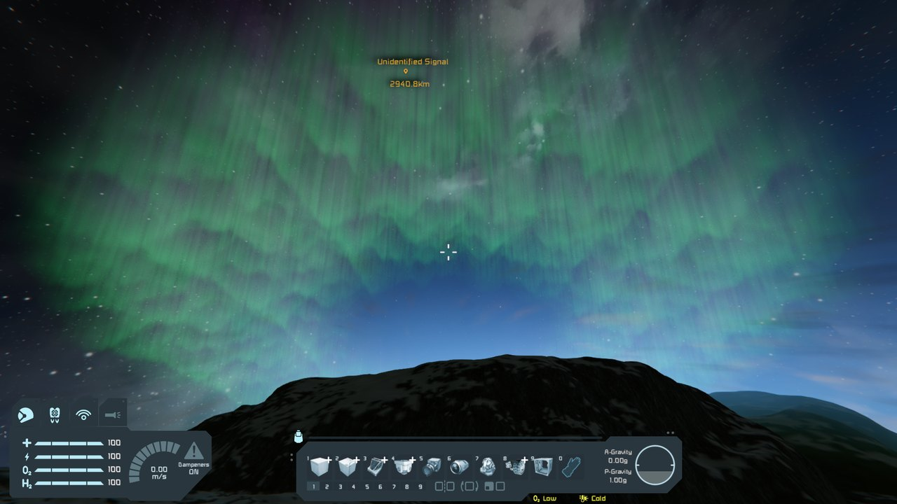

Same orbital vantage point as the "polar arc from orbit" shot below. The arc no longer
stands well off the limb; it now hugs the planet, which is the intended consequence of
halving the altitude.

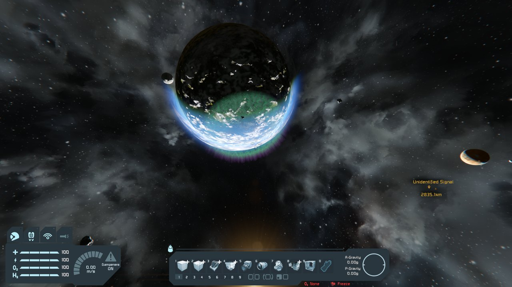

Same position as the "from under the shell" shot below — directly beneath the oval, now
only ~1.2 km under the shell floor. Still bright overhead at this range, but visibly
dimmer and more structured than the same shot at the old settings.

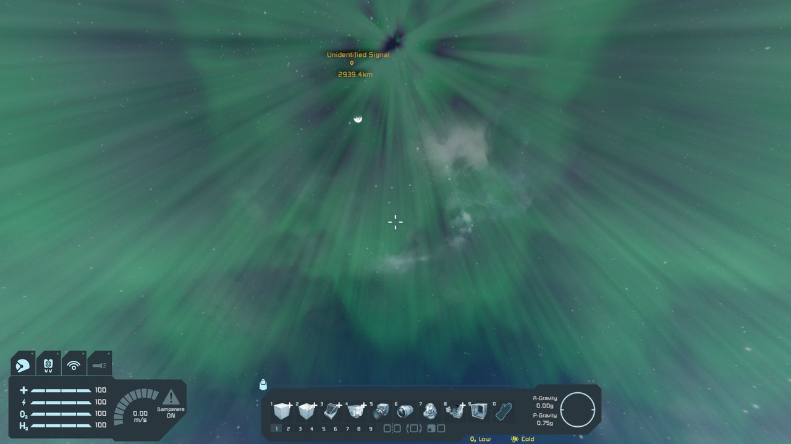

The screenshots in the rest of this document were taken **before** this change, at the
original 0.5–1.0 altitude and 2× multiplier.

## Atmosphere gating and density scaling

The aurora is limited to planets that have an atmosphere, and its brightness now follows
that atmosphere's density at ground level, normalised so an Earthlike planet is exactly
1.0. `MyPlanet.GetAirDensity()` reduces to the generator's `Atmosphere.Density` at
`AverageRadius` and returns 0 without an atmosphere, so a single call both gates the effect
and scales it.

Vanilla planet densities — only Alien differs from Earth, and `MyPlanetAtmosphere.Density`
defaults to 1.0 when a definition omits it (Titan, Europa):

| Planet | Has atmosphere | Ground density | Brightness |
|---|---|---|---|
| EarthLike | yes | 1.0 | ×1.0 |
| Alien | yes | 1.2 | ×1.2 |
| Mars, Triton, Pertam, Titan, Europa | yes | 1.0 | ×1.0 |
| **Moon** | **no** | 0 | **disabled** |

The sampler logs one line per planet it switches to, so the chosen target and its
brightness are checkable without reading pixels:

```
Aurora: nearest planet 'EarthLike': air density 1 -> brightness x1, shell 71.3-82.5 km
Aurora: nearest planet 'Moon': no atmosphere, aurora disabled
```

EarthLike at density 1.0 — the reference brightness, unchanged by the scaling:

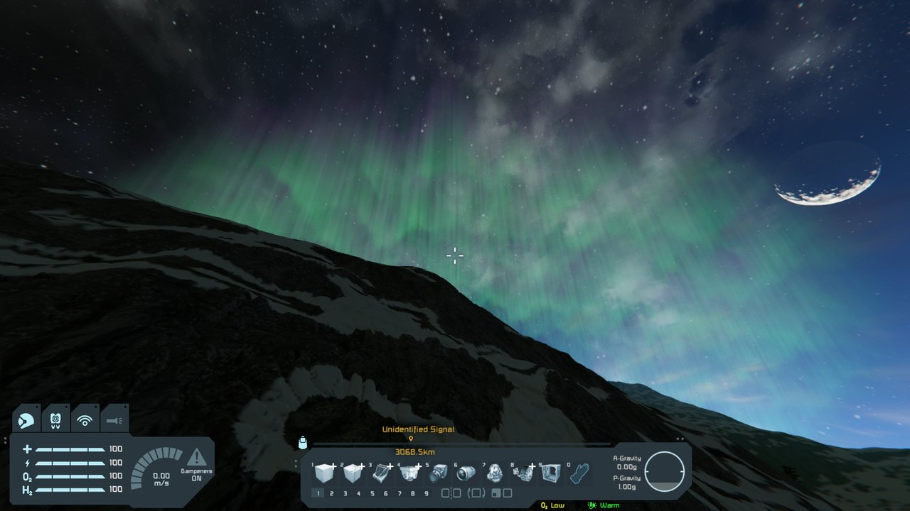

The Moon, 25 km from its centre. It has no atmosphere, so the effect is off entirely even
though the Earthlike planet is only 178 km away and well inside the plugin's range gate:

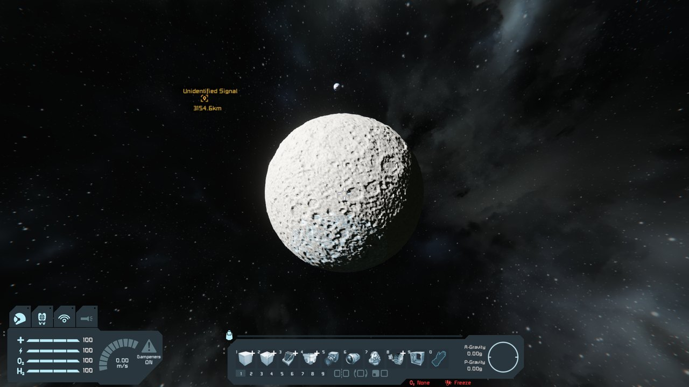

## What was verified

| # | Check | Result |
|---|---|---|
| 1 | Pulsar compiles the plugin from source (not just the IDE) | pass — after fixing the publicizer attribute, see below |
| 2 | Shader asset reaches the runtime under Pulsar | pass — `AssetFolder` + `LoadAssets` |
| 3 | Plugin appears in the Pulsar plugin list and initialises | pass, [screenshot](Screenshots/01-pulsar-plugin-loaded.jpg) |
| 4 | Harmony postfix on `MyAtmosphereRenderer.RenderGBuffer` draws | pass |
| 5 | HLSL compiles at runtime through the game's shader registry | pass — no `MyRenderException`, no errors in the game log |
| 6 | Aurora appears over **both** poles (`abs()` on the latitude term) | pass, [screenshot](Screenshots/02-both-poles-night-side.jpg) |
| 7 | Correct altitude band — above the atmosphere haze, below space | pass, [screenshot](Screenshots/03-polar-arc-from-orbit.jpg) |
| 8 | Correct latitude band around the pole | pass — arc sits at the configured 64°–76° |
| 9 | Vertical colour ramp (green lower edge → purple upper tail) | pass |
| 10 | Renders from **inside** the shell looking up | pass after fix, [screenshot](Screenshots/04-from-under-the-shell.jpg) |
| 11 | Night-only gating suppresses the effect in daylight | pass, [screenshot](Screenshots/05-day-side-suppressed.jpg) |
| 12 | `Enabled` master switch removes the effect completely | pass, [screenshot](Screenshots/06-effect-disabled.jpg) |
| 13 | Render state fully restored (no artefacts once disabled) | pass — base game renders normally |
| 14 | Settings dialog shows every Plan §6 option and applies live | pass, [screenshot](Screenshots/07-settings-dialog.jpg) |
| 15 | Config persists to `%AppData%\SpaceEngineers\Storage\Aurora.cfg` | pass |
| 16 | No exceptions or error spam in the game / Pulsar logs | pass |
| 17 | Altitude / thickness / brightness changes take effect as configured | pass, [see above](#lowered-aurora-current-defaults) |
| 18 | Airless planets and moons get no aurora at all | pass, [screenshot](Screenshots/14-moon-no-atmosphere.jpg) |
| 19 | Brightness scales with ground level atmosphere density, Earthlike = 1.0 | pass, [see above](#atmosphere-gating-and-density-scaling) |

## Screenshots

### Aurora over both poles, night side

Camera 186 km from the planet centre. Both auroral arcs are visible at the limb, sitting
above the blue atmosphere rim, with the green lower edge and purple upper tail of the
gradient LUT.

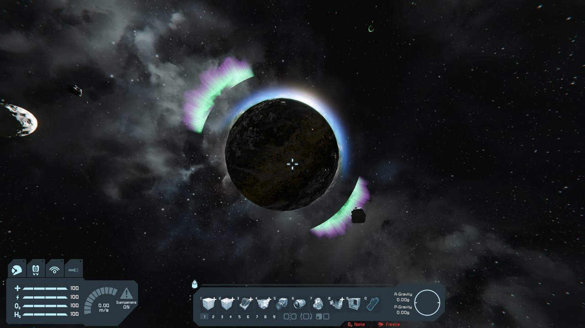

### Polar arc from orbit

Camera at 175 km, latitude −62°, aimed at the south pole. This is the effect as intended:
a bright arc over the polar cap with visible curtain striations, compositing over the
terminator.

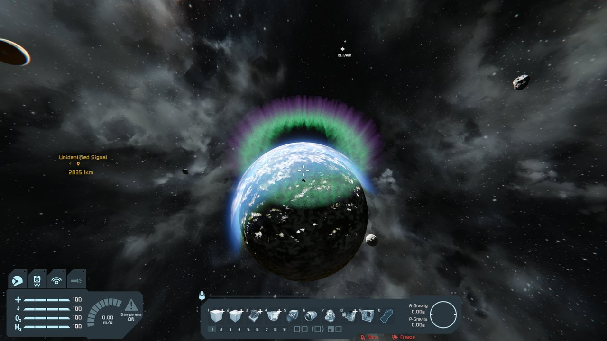

### From under the shell

Camera 10 km above the surface at latitude −70°, i.e. directly beneath the auroral oval,
looking up. Rays converge towards the magnetic zenith, which is how a real auroral corona
behaves — but see the note on the vertical extrusion below.

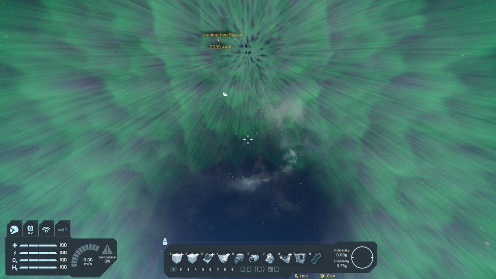

### Night-only gating

Same plugin settings, camera moved over the sunlit hemisphere. The aurora is fully
suppressed, which is the intended default behaviour.

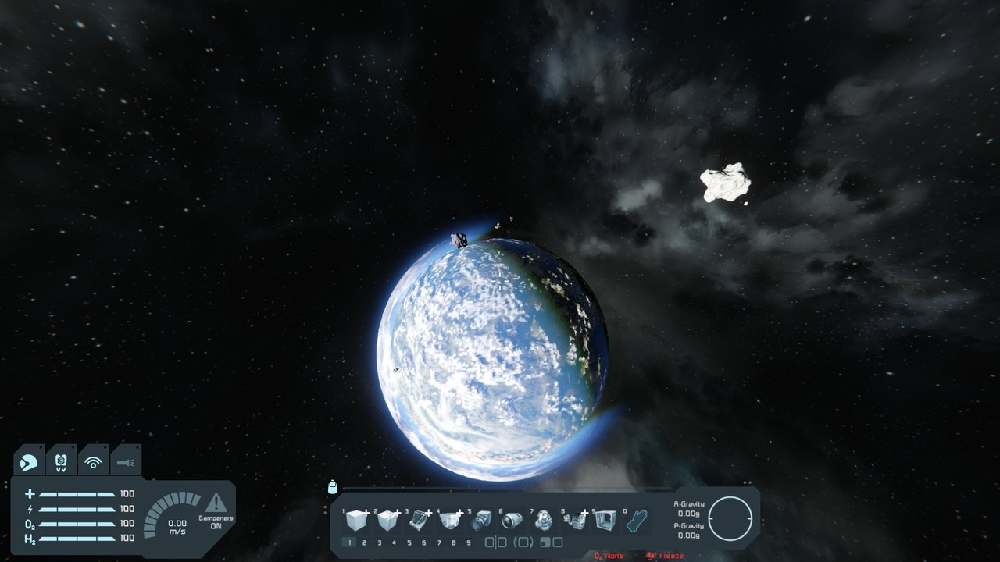

### Master switch off

Same viewpoint as the "from under the shell" shot, with `Enabled` unchecked in the
settings dialog. The effect disappears and the game renders normally, confirming the
render state is restored and nothing leaks into the following stages.

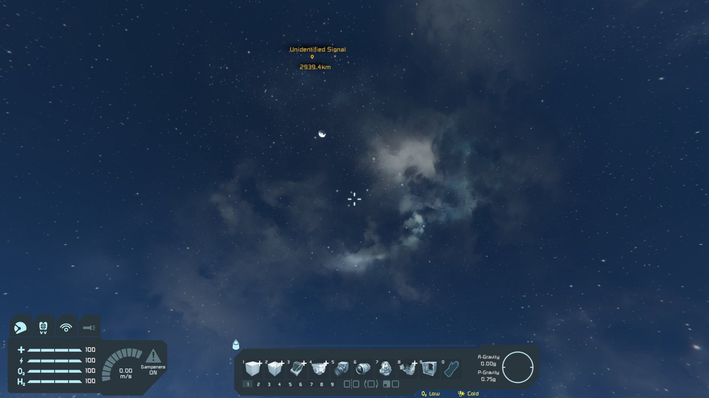

### Settings dialog

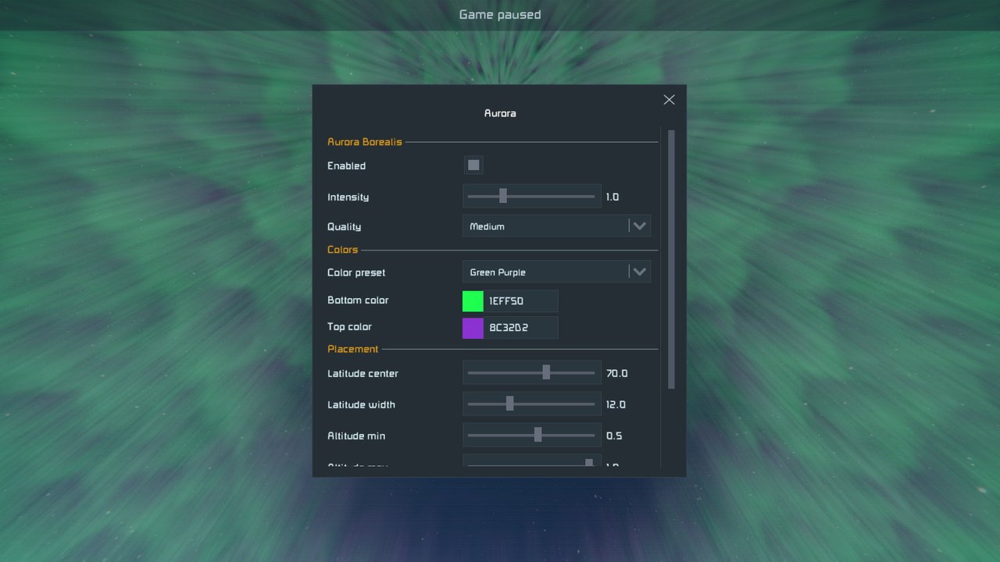

## Defects found and fixed during the run

### 1. Pulsar's from-source build failed (`CS0122`)

The IDE build succeeded but Pulsar's build did not:

```
CS0122: 'IgnoresAccessChecksToAttribute' is inaccessible due to its protection level
```

`ClientPlugin/Tools/GameAssembliesToPublicize.cs` had been uncommented but the matching
attribute class in `ClientPlugin/Tools/IgnoresAccessChecksToAttribute.cs` had not. The IDE
build never noticed, because `Krafs.Publicizer` generates that attribute itself under
`DEV_BUILD`; Pulsar compiles the sources directly and has no such generator. **This is
exactly the class of failure the dev-folder test exists to catch** — everything a player
installs from PluginHub is built the Pulsar way.

### 2. The shader file was not reaching the runtime

Pulsar compiles the `.cs` files with Roslyn and never runs MSBuild, so the
`EmbeddedResource` entry in the `.csproj` produced nothing in Pulsar's build and
`GetManifestResourceStream` returned `null`. Fixed by declaring
`<AssetFolder>ClientPlugin/Shaders/</AssetFolder>` in `Aurora.xml` and implementing
`IPlugin.LoadAssets`, keeping the embedded resource as the fallback for MSBuild/IDE
builds.

### 3. Unbounded emission flooded the sky (visual)

Marching accumulated raw emission, so a ray crossing the shell near the tangent — which
is most of the sky when the camera sits under the shell — integrated many times the shell
thickness and blew out to a solid wall of green:

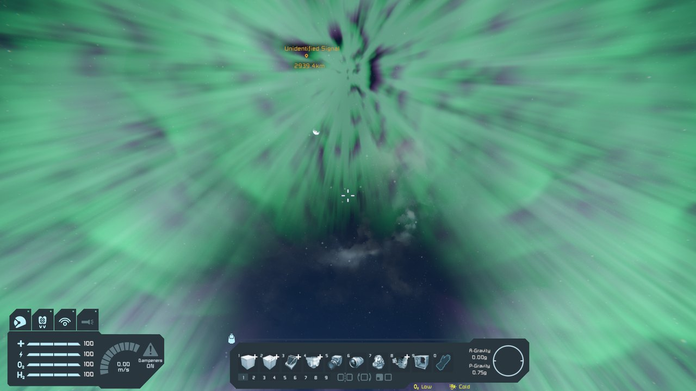

Fixed by saturating the integral exponentially in `AuroraBorealis.hlsl`
(`1 - exp(-optical)`), which bounds the output at the tint's HDR value, and lowering the
base HDR multiplier from 5 to 2 to suit the new curve.

### 4. Radial spokes converging on the pole (visual)

The noise was sampled on `(longitude, sin(latitude))`. Meridians converge at the pole, so
the noise was compressed in U and smeared into hard radial spokes right where the effect
is meant to look its best — visible as the streaking over the cap here:

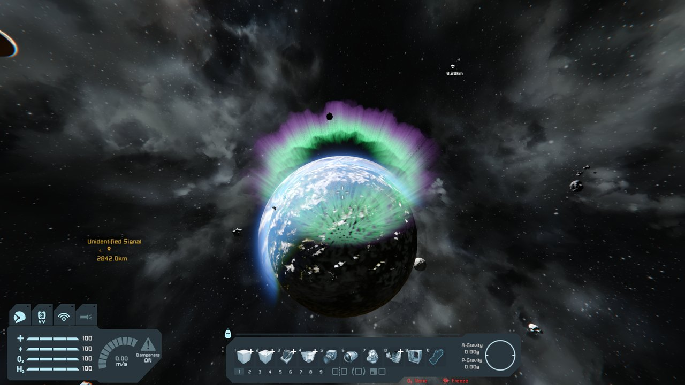

Fixed by sampling on the azimuthal (tangent-plane) projection around the pole axis,
`(dot(dir, T1), dot(dir, T2))`, which has neither a convergence point nor a longitude
seam, and retuning the two noise tiling factors to 18/21.

## Known behaviour worth noting

- **Night gating is camera-global, not per-pixel.** `AuroraRenderer.ComputeNightFactor`
  scales the whole effect by one scalar derived from the camera's position relative to the
  sun, as designed in Plan §2.6. Near the terminator this means the arc can still be drawn
  over a sunlit part of the polar cap. A per-fragment version would need the sun direction
  applied inside the march.
- **Vertical extrusion is visible from directly underneath.** The 2.5D approach (noise on
  the horizontal plane, extruded radially) means every curtain is a radial column, so from
  under the oval they all project towards the zenith. This reads as an auroral corona and
  is arguably correct, but it is a consequence of the technique rather than a simulation of
  it.
- The world had to be loaded from the XML sector for the test harness to reposition the
  character, which makes the game show its "file format of this world is outdated" notice.
  That is a property of the test setup, not of the plugin.

## Reproducing

The plugin was registered as a Pulsar dev folder rather than a compiled DLL, so Pulsar
builds it from source exactly as it would for a player:

`%AppData%\Roaming\Pulsar\Interim\Sources\sources.xml`

```xml
<LocalPlugin>
  <Name>se-aurora</Name>
  <Folder>C:\Dev\SE1\Plugins\se-aurora</Folder>
  <Enabled>true</Enabled>
</LocalPlugin>
```

`%AppData%\Roaming\Pulsar\Interim\Profiles\Aurora Test.xml` (copied to `Current.xml` to
activate it):

```xml
<DevFolder>
  <LocalFolderConfig>
    <Id>se-remote</Id><DataFile>Remote.xml</DataFile><DebugBuild>true</DebugBuild>
  </LocalFolderConfig>
  <LocalFolderConfig>
    <Id>se-aurora</Id><DataFile>Aurora.xml</DataFile><DebugBuild>true</DebugBuild>
  </LocalFolderConfig>
</DevFolder>
```

The client was then driven through the Remote API (`http://127.0.0.1:24158`) to create the
world, and the camera was placed at each vantage point by rewriting the character's
`PositionAndOrientation` in `SANDBOX_0_0_0_.sbs` and reloading. The game prefers the
ProtoBuf sector (`.sbsB5`) over the XML one, so that file has to be deleted for an edit to
take effect.
