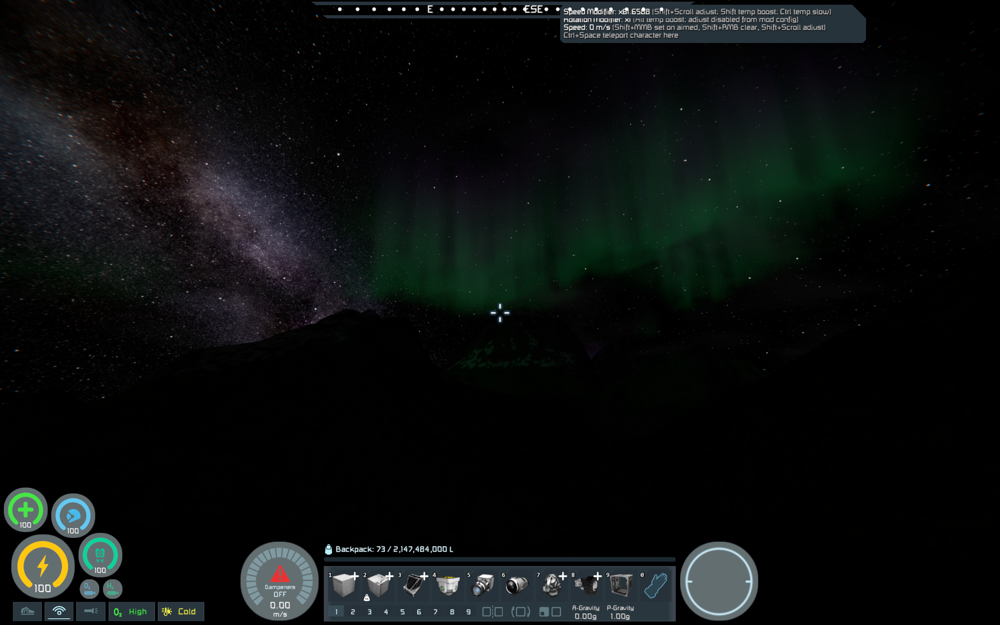
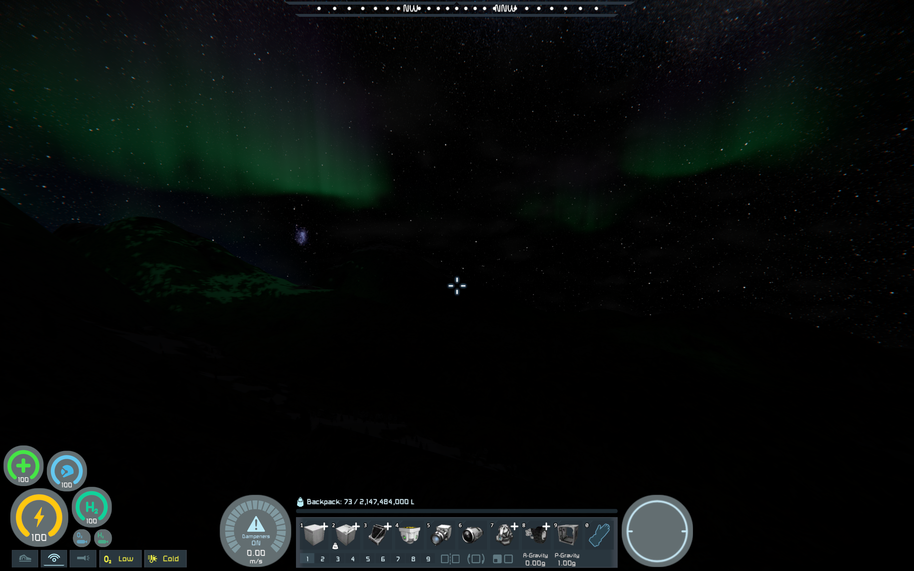
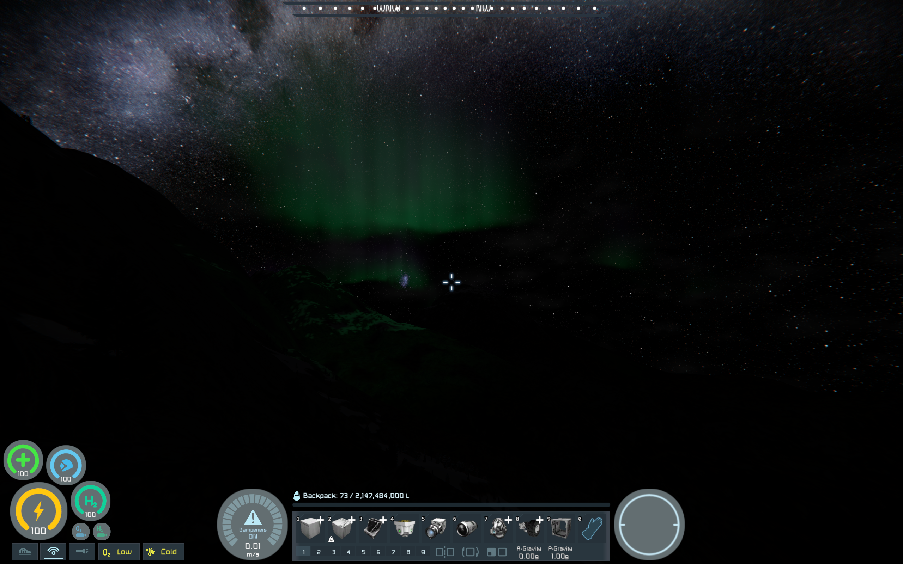

# Aurora Borealis for Space Engineers

Aurora Borealis (Northern Lights) over the poles of planets with an atmosphere.

For support please join the Pulsar Discord: https://discord.gg/z8ZczP2YZY

Please consider supporting my work on Patreon: https://www.patreon.com/semods

## Prerequisites

- [Space Engineers](https://store.steampowered.com/app/244850/Space_Engineers/)
- [Pulsar](https://github.com/SpaceGT/Pulsar)

## How to use

Enable the Aurora Borealis plugin in Pulsar's Plugins dialog.

## Functionality

Renders volumetric Aurora Borealis (Northern Lights)
over the poles of planets which have an atmosphere.

Open the plugin's Settings for the configuration.

### Original algorithm
- https://blog.roytheunissen.com/2022/09/17/aurora-borealis-a-breakdown/
- https://github.com/RoyTheunissen/Aurora-Borealis-Unity

## Screenshots

Made with the realistic Milky Way skybox.

The night is so much more alive!

